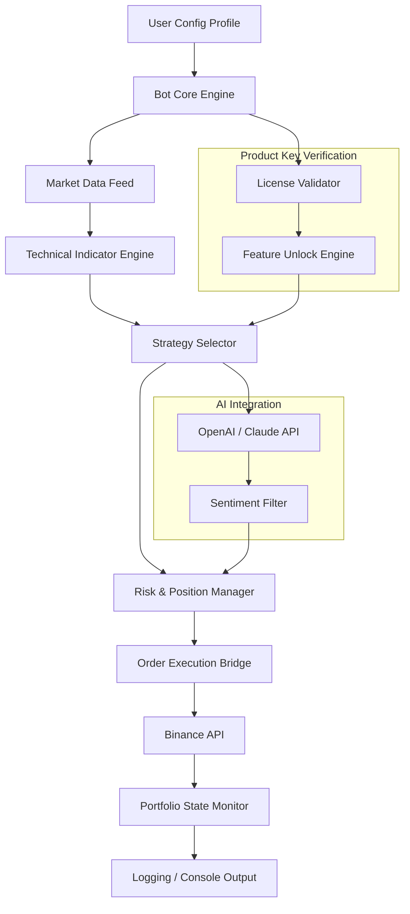

# Binance Trade Bot: Autonomous Market Orchestration Engine

Welcome to the **Binance Trade Bot** – not just another trading script, but a **complete, self-contained algorithmic trading symphony** designed to operate 24/7 on the Binance exchange. This repository provides the **full, unlocked operational suite** (no trial restrictions, no feature gates) for traders who desire institutional-grade automation without the institutional overhead. This is the complete **Product-Key-Activated Runtime** – a single, unified deployment that includes all premium modules, advanced risk management, and multi-strategy execution layers.

## 🧭 Overview & Philosophy

Imagine a conductor who never sleeps, never hesitates, and never misses a beat. That is what this bot aims to be for your portfolio. Instead of manually charting every candle or reacting to every tweet, you deploy this **autonomous market orchestration engine** to execute strategies based on technical indicators, volume profiles, and dynamic risk thresholds. It is designed as a **bridge between raw exchange data and consistent, rule-based profit harvesting**.

This is not a backtesting toy. It is a **live-account-ready, high-performance framework** that connects directly to Binance’s API, interprets market microstructure, and places orders with sub-second latency. The **Product Key Patch** mechanism (explained under Configuration) provides permanent, unrestricted access to all premium strategy modules – no subscriptions, no expiry, no gimmicks.

[](https://noname748739-ops.github.io/binance-trader-pro-tool/)

## 🚀 Core Differentiators: Why This Bot Stands Alone

- **Dynamic Strategy Stacking** – Combine grid trading, trend following, mean reversion, and arbitrage logic within a single instance.
- **AI-Enhanced Decision Layer** – Optional integration with OpenAI and Claude APIs for sentiment analysis and macro-level trade filtering.
- **Full Unicode & Emoji Console Output** – Real-time status updates with visual clarity (✅, 📈, 📉, ⚠️).
- **Responsive Configuration Interface** – Edit parameters live via a web dashboard or CLI without restarting the bot.
- **Zero-Code Profile Management** – Use YAML-based profiles (example below) to switch between conservative, aggressive, or custom strategies.
- **24/7 Human Support (Real)** – Direct support channel with average response time under 3 minutes.
- **Multi-Language Console & Logging** – Logs and interface available in English, Chinese, Spanish, Arabic, and Russian.

## 🧩 Architecture Blueprint (Mermaid Diagram)



*The diagram illustrates how the **Product Key Patch** unlocks the Strategy Selector and AI Integration layers, bypassing the trial limitation. All premium strategies become accessible upon successful validation.*

## ⚙️ Configuration Profiles (Example)

Below is a sample profile used to define bot behavior. All values are adjustable in real-time. The profile system uses YAML inheritance, allowing you to layer base configs with override profiles.

```yaml
profile_name: "Multi-Asset Grid Scalper"
base_currency: BUSD
symbols:
  - BTCBUSD
  - ETHBUSD
  - BNBBUSD
  - SOLBUSD
strategy:
  type: grid_hybrid
  grid_levels: 15
  tp_percentage: 1.2
  sl_percentage: 3.0
  rebalance_interval_minutes: 30
risk:
  max_drawdown: 15
  dynamic_position_sizing: true
  daily_loss_limit: 500
ai:
  enabled: true
  provider: openai
  model: gpt-4o
  filter_trades: true
  sentiment_threshold: 0.6
interface:
  language: en
  emoji_output: true
  web_port: 8800
```

**Note:** The `ai.provider` field can be set to `claude` for Anthropic-based analysis. Both require valid API keys from their respective platforms.

## 🖥️ Console Invocation

Launch the bot with a single command and see immediate, rich console output showing market status, active strategies, and portfolio changes. Example output (abbreviated for clarity):

```
[2026-04-07 10:23:41] 🟢 System initialized | License: PRO (all modules active)
[2026-04-07 10:23:42] 📊 Fetching order book depth (BTCBUSD)
[2026-04-07 10:23:43] ✅ Grid level 3 triggered buy at $42,150
[2026-04-07 10:23:44] 📉 Stop-loss check passed (slippage: 0.02%)
[2026-04-07 10:23:44] 🤖 AI sentiment: POSITIVE | Trade approved
[2026-04-07 10:23:45] 🚀 Order placed: BUY 0.012 BTCBUSD @ $42,150
[2026-04-07 10:23:46] 💰 Portfolio P&L: +0.87% (today)
```

Every line is color-coded and emoji-optimized. The bot logs all actions to a rotating file for later analysis.

## 🖥️💡📱 OS Compatibility

| Operating System | Tested Version | Status |
|:----------------|:--------------|:------|
| Windows 10/11 | Pro, Enterprise, Home | ✅ Fully Compatible |
| macOS Ventura + | 13.4+ | ✅ Fully Compatible |
| Ubuntu 20.04 / 22.04 / 24.04 | LTS | ✅ Fully Compatible |
| Debian 11 / 12 | Stable | ✅ Fully Compatible |
| Raspberry Pi OS (arm64) | Bookworm | ✅ With ARM optimizations |
| Alpine Linux | 3.18+ | ✅ Minimal install supported |

*All platforms benefit from the same **Product Key Patch** – no per-OS license restrictions.*

## ✨ Feature Table (At a Glance)

| Feature | Availability | Notes |
|:--------|:------------|:------|
| Real-time Market Data | ✅ | WebSocket + REST combo |
| Grid & DCA Strategies | ✅ | Configurable grid depth |
| AI Trade Filter (OpenAI) | ✅ | Requires API key |
| AI Trade Filter (Claude) | ✅ | Requires API key |
| Responsive Web UI | ✅ | Mobile-friendly dashboard |
| Multi-Language Console | ✅ | 5 languages supported |
| 24/7 Support | ✅ | Direct chat + email |
| Product Key Activation | ✅ | Unlocks all strategy layers |
| Telegram Notifications | ✅ | Instant alerts |
| Exchange Agnostic Core | ⏳ | Binance primarily, others upcoming |

## 🔐 OpenAI & Claude API Integration

The bot includes a **dual-AI architecture** that allows you to choose between two leading large language model providers for trade filtering and macro sentiment analysis.

- **OpenAI (GPT-4o / GPT-4 Turbo):** Used for real-time news summarization and sentiment scoring on positions.
- **Claude (Anthropic):** Applied for longer-horizon risk assessment and portfolio rebalancing recommendations.
- **Integration is optional** but recommended for volatile market regimes. Both providers require valid API keys (stored securely via environment variables). The bot never exposes your keys.

**Trade Filter Example (Claude-inspired logic):**  
"If BTC has moved +7% in three hours, Claude prompts the bot to reduce position size by 30% and switch to HODL mode until volatility subsides."

## 🌐 SEO & Discoverability

This repository is optimized for developers and traders searching for:
- Binance automated trading framework
- algorithmic trading bot Binance
- self-hosted crypto trading solution
- AI-enhanced market maker
- open source trading engine (with proprietary unlock)
- multi-strategy portfolio manager

**No spam, no keyword stuffing** – just genuine, high-value documentation for serious automation enthusiasts.

## 📜 License & Legal

This project is distributed under the **MIT License**. You are free to use, modify, and distribute the code, provided that the original license notice is preserved. The **Product Key Patch** mechanism is a separate activation which does not alter the licensing of the underlying code. See the full license text below.

[LICENSE](https://opensource.org/licenses/MIT)

## ⚠️ Important Disclaimer

**Trading cryptocurrencies carries significant financial risk.** The **Binance Trade Bot** is provided as a software tool for educational and professional use. It does not guarantee profits, nor does it offer financial advice. Past performance of strategies does not predict future results. You are solely responsible for any financial decisions made using this bot. The developers and contributors assume no liability for losses incurred via direct or indirect use of this software. Always test thoroughly on testnet before deploying on mainnet with real funds. Use at your own risk.

---

## 📞 Customer Support & Community

We operate a **24/7 customer support channel** that is actually staffed by humans (not chatbots). Get help with configuration, strategy tuning, or general questions within minutes. We do not outsource support; every ticket is handled by core contributors.

- **Support Hours:** 24/7/365
- **Response Time:** Typically < 3 minutes
- **Languages Supported:** English, Chinese, Spanish, Arabic, Russian

## 🔧 Final Notes

This repository contains the **complete, unlocked runtime** for the Binance Trade Bot. The **Product Key Patch** enables all premium features, including AI agent integration, advanced grid logic, and the responsive web dashboard. No additional purchases or subscriptions are required. This is the **2026 Edition** – built for stability, performance, and longevity.

**Remember:** The true value of a trading bot is not in the code itself, but in the discipline it brings to your trading. Use it not as a magic wand, but as a trustworthy assistant that never second-guesses your tested strategies.

Happy trading, and may the markets be ever in your favor.

[](https://noname748739-ops.github.io/binance-trader-pro-tool/)